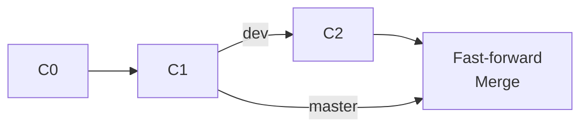
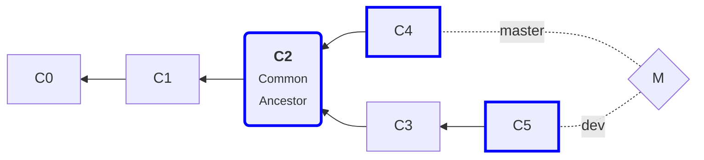
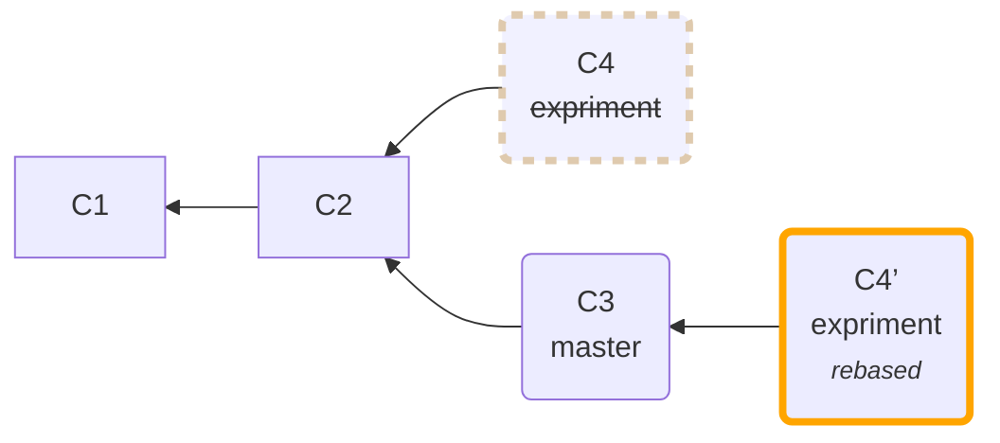
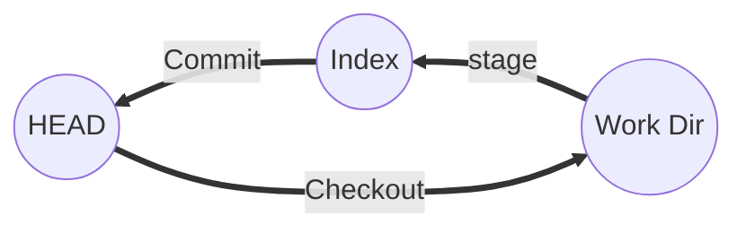

# Tips & Summaries for *Pro Git*

The notes for *Pro Git*. Written By Cattle with :heart:

### TODO

- [ ] git rm
- [ ] git push 各种参数 + 高级用法
- [ ] git revert


## 1.6 起步 - 初次运行 Git 前的配置

Git 的分级配置：

1. `/etc/gitconfig` 文件: 包含系统上每一个用户及他们仓库的通用配置。 使用 `git config --system` 
2. `~/.gitconfig` 或 `~/.config/git/config` 文件：只针对当前用户。 可以传递 `--global` 选项让 Git 读写此文件。
3. 当前使用仓库的 Git 目录中的 `config` 文件（就是 `.git/config`）：针对该仓库。

每一个级别覆盖上一级别的配置。


## 1.3 起步 - Git 基础

- Git 更像是把数据看作是**对小型文件系统的一组快照**。每次你提交更新，或在 Git 中保存项目状态时，它主要对当时的全部文件制作一个快照并保存这个快照的索引。
- Git 中所有数据在存储前都计算校验和，然后以校验和来引用——不可能在 Git 不知情时更改任何文件内容或目录内容。
- Git 中的绝大多数操作都只需要访问本地文件和资源，一般不需要来自网络上其它计算机的信息。

- 你执行的 Git 操作，几乎只往 Git 数据库中增加数据。很难让 Git 执行任何不可逆操作，或者让它以任何方式清除数据。一旦你提交快照到 Git 中，就难以再丢失数据。


你的文件可能处于**三种状态之一**：:star:

| Which           |                                                              | Where               |                                                              |
| --------------- | ------------------------------------------------------------ | ------------------- | ------------------------------------------------------------ |
| 已提交 commited | 已经安全的保存在本地数据库中。                               | Git 仓库 Repository | 保存项目的元数据和对象数据库的地方，是最重要的部分。         |
| 已暂存 staged   | 对一个已修改文件的当前版本做了标记，使之包含在下次提交的快照中。 | 暂存区（索引）      | 一个文件，保存了下次将提交的文件列表信息，一般在 Git 仓库目录中。 |
| 已修改 modified | 修改了文件，但还没保存到数据库中。                           | 工作目录            | 对项目的某个版本独立提取出来的内容，供你使用或修改。         |

## 2.2 Git 基础 - 记录每次更新到仓库

**你工作目录下的每一个文件都不外乎这两种状态：已跟踪或未跟踪。**

- 已跟踪的文件是指那些被纳入了版本控制的文件，**它们的状态可能处于未修改，已修改或已放入暂存区**。
- 其它文件都属于未跟踪文件，它们既不存在于上次快照的记录中，**也没有放入暂存区**。


*Figure 1. 文件的状态变化周期* :star:

**`git status`**

`git status -s` 命令或 `git status --short` 命令，更为紧凑的格式输出：

```
M README         # 左M：被修改且在暂存区
MM Rakefile      # 右M：被修改但未暂存
A  lib/git.rb    # 新添加到暂存区中
?? LICENSE.txt   # 未跟踪文件
```

匹配模式以（`/`）结尾指定目录。要忽略以外的文件或目录，在模式前加上惊叹号（`!`）。

**`git diff`**

- 要查看**尚未暂存的文件**更新了哪些部分，不加参数直接输入 `git diff`

- 若要查看已暂存的内容，可以用 `git diff --cached`or `--staged` 命令。
- 请注意，`git diff` **本身只显示尚未暂存的**改动，**而不是**自上次提交以来所做的所有改动。
- 使用 `git difftool` 命令 - Git Diff 插件。    ` --tool-help` 

**`git commit`**

更详细的对修改了哪些内容的提示? 可以用 `-v` 选项，这会将改变的 diff 输出放到编辑器

`git commit -a` ，Git 就会自动把所有已经跟踪过的文件暂存起来一并提交.

**`git rm`**   [不带参数] 从工作区删除 + 从暂存区删除（标记为删除）

`git rm --cached `  从仓库删除，不想让 Git 继续跟踪，但保留文件。


不像其它的 VCS 系统，Git 并不显式跟踪文件移动操作，但它会推断出改名操作。运行 `git mv` 就相当于运行了下面三条命令：*（语法糖？）*

```console
$ mv README.md README
$ git rm README.md
$ git add README
```


## 2.3 Git 基础 - 查看提交历史

**`git log`**

`-p -2 --stat --pretty=oneline|short|full|fuller`

```
$ git log -<n>               # 仅最近的n条提交
$ git log --since=2.weeks    # 按时间
$ git log --until=2 years 1 day 3 minutes ago
$ git log -S function_name   # 添加或移除了某些字符串的提交
                             # (例如：添加或移除了某一个特定函数的引用的提交)
$ git log -- <path>          # 指定的文件或目录
```

用 `--author` 选项显示指定作者的提交，用 `--grep` 选项搜索提交说明中的关键字。

如果要得到**同时满足这两个**选项搜索条件的提交，就**必须用** `--all-match` 选项。

【举例】 `git log --oneline --decorate --graph --all` ，它会输出你的提交历史、各个分支的指向以及项目的分支分叉情况。

灵活使用参数，提高生产力！

| 选项:star:        | 说明                                                         |                                        |
| ----------------- | ------------------------------------------------------------ | -------------------------------------- |
| `-p`              | 按补丁(diff)格式显示每个更新之间的差异。                     | `diff --git a/.babelrc b/.babelrc`     |
| `--stat`          | 显示每次更新的文件修改统计信息。:star:                       |                                        |
| `--shortstat`     | 只显示 --stat 中最后的行数修改添加移除统计。                 | `48 files changed, 7835 insertions(+)` |
| `--name-only`     | 仅在提交信息后显示已修改的文件清单。                         |                                        |
| `--name-status`   | 显示新增、修改、删除的文件清单。                             |                                        |
| `--abbrev-commit` | 仅显示 SHA-1 的前几个字符，而非所有的 40 个字符。            |                                        |
| `--relative-date` | 使用较短的相对时间显示（比如，“2 weeks ago”）。              |                                        |
| `--graph`         | :star:显示 ASCII 图形表示的分支合并历史。                    |                                        |
| `--pretty`        | 使用其他格式显示历史提交信息。可用的选项包括 oneline，short，full，fuller 和 format（后跟指定格式）。<br />[`git log --pretty=format` 常用的选项](https://git-scm.com/book/zh/v2/ch00/rpretty_format) 列出了常用的格式占位符写法及其代表的意义。 |                                        |


> *作者* 和 *提交者* 之间究竟有何差别，
> 其实作者指的是实际作出修改的人，提交者指的是最后将此工作成果提交到仓库的人。所以，当你为某个项目发布补丁，然后某个核心成员将你的补丁并入项目时，你就是作者，而那个核心成员就是提交者。

## 2.4 Git 基础 - 撤消操作

- 都知道的：

```console
$ git commit --amend
# -a 是 --all 的缩写
```
-  取消暂存 `CONTRIBUTING.md` 文件
   同时看“重置揭秘”，加深理解。

```
$ git reset HEAD CONTRIBUTING.md
```

不加选项地调用 `git reset` 并不危险 — 它只会修改暂存区域。

- 如何撤消之前所做的修改。

```console
git checkout -- CONTRIBUTING.md
# 不需要 --hard 之类哦。
# 这是危险的命令。除非你确实不想要那个文件
```

记住，在 Git 中任何 *已提交的* 东西几乎总是可以恢复的。

## 2.5 Git 基础 - 远程仓库的使用

`git fetch [remote-name]`访问远程仓库，从中拉取所有你还没有的数据。**必须注意**它并不会自动合并或修改你当前的工作。

如果你有一个分支设置为跟踪一个远程分支可使用 `git pull` 命令来自动的抓取然后合并远程分支到当前分支。
运行 `git pull` 通常会从最初克隆的服务器上抓取数据并自动尝试合并到当前所在的分支。

`git push origin master`

更多 `git remote`的操作：

```console
$ git remote      # 列出远端的列表
$ git remote -v   # 同上，但查看更详细信息
$ git remote show [remote-name]   # 更多信息，可以使用 
$ git remote add pb https://github.com/paulboone/ticgit
$ git remote rename pb paul
$ git remote rm paul
```


## 2.6 Git 基础 - 打标签

- 列出已有标签  `git tag`
- 列出具体的？  `git tag -l 'v1.8.*' `     ` (-l = --list)`

两种主要类型的标签：轻量标签（lightweight）与附注标签（annotated）。

**附注标签**（a = annotation）

附注标签是存储在 Git 数据库中的一个完整对象。它们是可以被校验的。

```
$ git tag -a v1.4 -m 'my version 1.4'
```

`-m` 选项指定了一条将会存储在标签中的信息。如果没有为附注标签指定一条信息，Git 会运行编辑器要求你输入信息（就像`git commit`）。

**轻量标签**

轻量标签本质上是将提交校验和存储到一个文件中，没有其他信息。只需要提供标签名字：`$ git tag v1.4-lw`

也可在命令之后指定一个引用（默认是当前 / HEAD）。

**共享标签**

在创建完标签后你必须**显式地推送**标签到共享服务器上。

```
$ git push origin [tagname]
# 或者，想一次性推送很多标签？
$ git push origin --tags
```

## 2.7 Git 基础 - Git 别名

设置 Git 别名：

```console
$ git config --global alias.co checkout
$ git config --global alias.last 'log -1 HEAD'
# 想要执行外部命令，而不是一个 Git 命令？前面加入 ! 符号。
$ git config --global alias.visual '!gitk'
```


## 3.1 Git 分支 - 分支简介

>

Git 分支本质上仅仅是指向提交对象的可变指针（包含所指对象校验和的文件），它在每次的提交操作中自动向前移动。

它有一个名为 `HEAD` 的特殊指针。（和许多其它版本控制系统里的 `HEAD` 概念完全不同。）

Git是怎么知道当前在哪一个分支上呢？Git 使用名为 `HEAD` 的特殊指针，它指向当前所在的本地分支。

:notebook:HEAD可以指向一个分支引用，分支又指向一次提交。*看看“Git内部原理”加深理解*。

>  Git 的分支实质上仅是包含所指对象校验和（SHA-1 值字符串）的文件，所以它的创建和销毁都异常高效。
>
> 当使用 `git commit` 进行提交操作时，Git 会先计算每一个子目录（本例中只有项目根目录）的校验和，然后在 Git 仓库中这些校验和保存为树对象。随后，Git 便会创建一个提交对象，它除了包含上面提到的那些信息外，还包含指向这个树对象（项目根目录）的指针。

运行 `git log --oneline --decorate --graph --all` ，它会输出你的提交历史、各个分支的指向以及项目的分支分叉情况。

## 3.2 Git 分支 - 分支的新建与合并

**快进（fast-forward）**合并：由于当前 `master` 分支所指向的提交是你当前提交的直接上游（合并操作没有需要解决的分歧），所以 Git 只是简单的将指针向前移动。

**删除分支**：`git branch -d <branch_name>`



**三方合并**：开发历史从一个更早的地方分叉*diverged*。Git 会使用两个分支的末端所指的快照（`C4` 和 `C5`）以及这两个分支的工作祖先（`C2`），做一个简单的三方合并。自动创建一个有**不止一个父提交的新的提交**。

>  “三方” 指合并的已方、他方和它们的共同祖先。  [这篇文章](https://gqqnbig.me/2017/08/20/%e7%89%88%e6%9c%ac%e6%8e%a7%e5%88%b6%e4%b8%ad%e7%9a%84%e4%b8%89%e6%96%b9%e5%90%88%e5%b9%b6/) 解释了共同祖先对于分支合并是非常重要的。“没有共同祖先，我们就难以确定如何合并，遑论机器了。”



##### 遇到冲突时

1. Git 会在有冲突的文件中加入标准的冲突解决标记。
2. 手动编辑，解决冲突。
3. 使用 `git status` 命令来查看那些因包含合并冲突而处于未合并（unmerged）状态的文件。
4. 对每个文件使用 `git add` 命令来将其标记为冲突已解决。
5. `git commit` 来完成合并提交。
6. 图形化工具？ `git mergetool`（可自定义，见“配置”章节）。

## 3.3 Git 分支 - 分支管理

```console
$ git branch              # 列出当前所有分支
$ git branch -v           # 查看每一个分支的最后一次提交
$ git branch --merged     # 列出已经合并到当前分支的分支
$ git branch --no-merged  # 包含未合并工作的分支
```

 `git branch -d` 命令删除未合并的分支会失败。`-D`来强制删。

## 3.4 Git 分支 - 分支开发工作流

> To: Appendix 1

## 3.5 Git 分支 - 远程分支

远程分支以 `(remote)/(branch)` 形式命名。只要你不与 origin 服务器连接，你的`origin/master` 指针就不会移动。

运行 `git fetch teamone` 来抓取远程仓库 `teamone` 有而本地没有的数据。

要公开分享一个分支？**本地的分支并不会自动与远程仓库同步**，运行 `git push (remote) (branch)`：

```console
$ git push origin serverfix
$ git push origin serverfix:anotherfix  # 两边使用不同的标签名
$ git push origin  # 设定了上游分支之后就不必写分支名了
```

Git 自动将 `serverfix` 分支名字**展开为** `refs/heads/serverfix:refs/heads/serverfix`。也可以使用不同的分支名字，例如运行`git push origin serverfix:awesomebranch` 来将本地的 `serverfix` 分支推送到远程仓库上的 `awesomebranch` 分支。

- [ ] What's ref/heads ?

  `ref/heads/master` <=> `.git/ref/heads/master`

  > 参见“Git 引用”这一章

下一次其他协作者从服务器上抓取数据时，他们会在本地生成一个远程分支 `origin/serverfix`，指向服务器的`serverfix` 分支的引用。:warning:【**注意**】：当抓取(fetch)到新的远程跟踪分支时，**本地不会**自动生成一份可编辑的副本`serverfix` 分支 ，只有一个**不可以修改的** `origin/serverfix` 指针。可以运行 `git merge origin/serverfix` -- 合并到当前所在的分支。 **`git pull` 在大多数情况下**它的含义是一个 `git fetch` 紧接着一个 `git merge` 命令。

如果想要在自己的 `serverfix` 分支上工作，可以将其建立在远程跟踪分支之上，Git会帮你设置好上游分支：

```console
$ git checkout -b serverfix origin/serverfix
# Git 提供了一个快捷命令，效果同上：
$ git checkout --track origin/serverfix
# 也可不同名：
$ git checkout -b sf origin/serverfix
```
也可显式地设置/修改正在跟踪的上游分支：
```console
$ git branch -u origin/serverfix   # or --set-upstream-to
Branch serverfix set up to track remote branch serverfix from origin.
```

查看设置的所有跟踪分支，可以使用 `git branch -vv` 

删除一个远程分支。只是从服务器上移除这个指针。Git 服务器通常会保留数据一段时间直到垃圾回收运行

```console
$ git push origin --delete serverfix
$ git push origin :serverfix # 用于较早版本的 Git
```


## 3.6 Git 分支 - 变基

使用 `rebase` 命令将提交到**某一分支上的所有修改都移至另一分支上**，就好像“重新播放”一样。**变基是将一系列提交按照原有次序依次应用到另一分支上，而合并是把最终结果合在一起。**

可以提取在 `C4` 中引入的补丁和修改，然后在 `C3` 的基础上应用一次。它的原理是首先找到这两个分支（即当前分支 `experiment`、变基操作的目标基底分支 `master`）的最近共同祖先 `C2`，然后对比当前分支相对于该祖先的历次提交，提取相应的修改并存为临时文件，然后将当前分支指向目标基底 `C3`, 最后以此将之前另存为临时文件的修改依序应用。




```console
$ git checkout experiment   # 当前分支是 experiment
$ git rebase master         # 变基 experiment 到 master上
# # 现在，expriment 在 master 前面了。
$ git checkout master
$ git merge experiment      # 将 expriment 合并到 master 分支上 （快进合并）
```


 `git rebase [basebranch] [topicbranch]` ：直接将特性分支（ `server`）变基到目标分支（即 `master`）上。这样做能省去你先checkout到 `server` 分支，再对其执行变基命令的多个步骤。

```console
$ git rebase master server  # 变基 server 到 master 上
```

使用 `git rebase --onto` ，如下：取出 `client` 分支，选中在 `client` 分支里但不在 `server` 分支里的修改（即 `C8` 和 `C9`），将它们在 `master` 分支上重放。

```console
$ git rebase --onto master server client
```

:speech_balloon: 总结一下，下面的命令（feature 变基到 master 上）是等价的。If \<upstream\> is not specified, the upstream configured in `branch.<name>.merge`  will be used (see [git-config1](https://git-scm.com/docs/git-config) for details) and the `--fork-point` option is assumed.  

```
$ git rebase --onto master master feature
$ git rebase master feature
$ git rebase master   # 假定目前的分支是 feature
$ git rebase          # 若配置好了 branch.<name>.merge

# Referance Format
$ git rebase [-i | --interactive] [<options>] [--exec <cmd>] [--onto <newbase>]
	[<upstream> [<branch>]]
```


#### 不合理的变基

**不要对在你的仓库外有副本的分支执行变基。** **变基操作的实质**是丢弃一些现有的提交，然后相应地新建一些内容一样但实际上不同的提交。如果你用 `git rebase` 命令重新整理了提交并再次推送，你的同伴因此将不得不再次将他们手头的工作与你的提交进行整合，如果接下来你还要拉取并整合他们修改过的提交，事情就会变得一团糟。

**用变基解决变基。**你拉取被覆盖过的更新并将你手头的工作基于此进行变基的话，一般情况下 Git 都能成功分辨出哪些是你的修改，并把它们应用到新分支上。

下面的例子（去看原文）中，我们不是执行合并，而是执行 `git rebase teamone/master`


## 4.1 服务器上的 Git - 协议

一个远程仓库通常只是一个**裸仓库**（*bare repository*）— 即一个没有当前工作目录的仓库，存放的只有 Git 的资料。简单的说，裸仓库仅是你工程目录内的 `.git` 子目录内容。

Git 可以使用**四种主要的协议**来传输资料：本地协议（Local），HTTP 协议（Smart / Dumb），SSH（Secure Shell）协议及 Git 协议。

最基本的就是 *本地协议（Local protocol）* ，其中的远程版本库就是硬盘内的另一个目录。

```console
$ git clone /opt/git/project.git
## 或你可以执行这个命令：
$ git clone file:///opt/git/project.git
```

如果在 URL 开头明确的指定 `file://`，那么 Git 的行为会略有不同。如果仅是指定路径，Git 会尝试使用硬链接（hard link）或直接复制所需要的文件。如果指定 `file://`，Git 会触发平时用于网路传输资料的进程，那通常是传输效率较低的方法。

Git 通过 HTTP 通信有两种模式。智能 HTTP 协议即支持像 `git://` 协议一样设置匿名服务，也可以像 SSH 协议一样提供传输时的授权和加密。哑 HTTP 协议里 web 服务器仅把裸版本库当作普通文件来对待，提供文件服务。哑 HTTP 协议的优美之处在于设置起来简单。如果你在 HTTP 上使用需授权的推送，管理凭证会比使用 SSH 密钥认证麻烦一些。参考 [凭证存储](https://git-scm.com/book/zh/v2/ch00/r_credential_caching) 如何安全地保存 HTTP 密码。

SSH 协议很高效，SSH 协议的缺点在于你不能通过他实现匿名访问。

Git 协议没有授权机制。目前，Git 协议是 Git 使用的网络传输协议里最快的。它缺乏授权机制，通常不能允许用户使用 Git 协议推送。

>  HTTPS 如何指定证书？ ==> "凭证存储"章节


## 4.2 服务器上的 Git - 在服务器上搭建 Git

在开始架设 Git 服务器前，需要把现有仓库导出为裸仓库。加上 `--bare`选项，只取出 Git 仓库自身，不要工作目录，然后特别为它单独创建一个目录。 *按照惯例，裸仓库目录名以 .git 结尾*。

```console
$ git clone --bare my_project my_project.git
```


## 5.2 分布式 Git - 向一个项目贡献

运行 `git diff --check`，它将会找到可能的空白错误并将它们为你列出来


## 7.1 Git 工具 - 选择修订版本:star:

值得注意的是，**引用日志只存在于本地仓库**，它是一个记录你在你自己的仓库里做过什么的日志。 其他人拷贝的仓库里的引用日志不会和你的相同。而你新克隆一个仓库的时候，引用日志是空的，因为你在仓库里还没有操作。

好几种选择某一特定版本的方式：

- *SHA-1*。当然你提供的 SHA-1 字符数量不得少于 4 个，并且没有歧义。
- 分支引用
- 引用日志 (`git reflog`)：`HEAD@{5}  master@{yesterday}`
- 祖先引用。`^n` 与 `~n` 的区别：
  -  `HEAD^`     `HEAD^2  # 第二父提交`
  - `HEAD~2`  第一父提交的第一父提交 ，等价于 `HEAD^^`
- 提交区间 :star:
  - `master..experiment`   experiment 分支中未在 master 分支（哪些提交尚未被合并入 master 分支）
  - `master...experiment`  master 或者 experiment 中包含的但不是两者共有的提交

因此下列3个命令是等价的：

```
$ git log refA..refB   # 在 refA 但不在 refB 中
$ git log ^refA refB
$ git log refB --not refA   
```

你想查看所有被 `refA` 或 `refB` 包含的但是不被 `refC` 包含的提交

```
$ git log refA refB ^refC
$ git log refA refB --not refC   
```

另一个常用的场景是查看你即将推送到远端的内容：输出在你当前分支中而不在远程 `origin` 中的提交。

```
$ git log origin/master..HEAD       
```


## 7.2 Git 工具 - 交互式暂存

> :speech_balloon: 个人感觉还是比较好用的！
>

运行 `git add` 时使用 `-i` 或者 `--interactive` 选项，Git 将会进入一个交互式终端模式

可以在命令行中使用 `git add -p` 或 `git add --patch`来启动同样的脚本。

更进一步地，可以使用 `reset --patch` 命令的补丁模式来部分重置文件，通过 `checkout --patch` 命令来部分检出文件与 `stash save --patch` 命令来部分暂存文件。


默认情况下，`git clean` 命令只会移除没有忽略的未跟踪文件。 任何与 `.gitiignore` 或其他忽略文件中的模式匹配的文件都不会被移除。 


现在运行 `git status` 会没有输出，因为三棵树又变得相同了。

`reset` 做的第一件事是移动 HEAD 的指向。 这与改变 HEAD 自身不同（`checkout` 所做的）；`reset` 移动 HEAD 指向的分支。


## 7.3 Git 工具 - 储藏与清理

#### 1> **`git stash list `**`| save | apply | pop | drop` 

`git stash` = `git stash save` (修改的跟踪文件与暂存的改动)。将你刚刚储藏的工作重新应用：`git stash apply`。如果想要应用其中一个更旧的储藏，可以通过名字指定它，像这样：`git stash apply stash@{2}`。运行 `git stash drop` 加上将要移除的储藏的名字来移除它。运行 `git stash pop` 来应用储藏然后立即从栈上扔掉它。

使用 `git stash apply --index` 选项来尝试重新应用暂存的修改。 If the `--index` option is used, then tries to reinstate not only the working tree’s changes, *but also the index’s ones*. 

一些实用的`save`选项：

- `stash save`  `--keep-index` 选项。If the `--keep-index` option is used, all changes already added to the index are left intact. 它告诉 Git 不要储藏任何你通过 git add 命令已暂存的东西。

- 默认情况下，`git stash save` 只会储藏已经在仓库中的文件。如果指定 `--include-untracked` 或 `-u` 标记，Git 也会储藏任何创建的未跟踪文件。

- `-p` `--patch` 标记，交互式地提示

- `--all` 暂存被忽略的文件 **和** 未跟踪的文件。（见下文）

- 

  | 选项                              | Modified files | In Index | Untracked | Ignored |
  | --------------------------------- | -------------- | -------- | --------- | ------- |
  | `save --keep-index`               | ✓              | ✘        | ✗         | ✗       |
  | `save`   <small>(default)</small> | ✓              | ✓        | ✗         | ✗       |
  | `save --include-untracked`        | ✓              | ✓        | ✔         | ✗       |
  | `save --all`                      | ✓              | ✓        | ✔         | ✔       |


可以运行 `git stash branch <branch_name>` 创建一个新分支，检出**储藏工作时所在的**提交，重新在那应用工作，然后在应用**成功后扔掉储藏**。

#### 2> **`git clean`**

谨慎，因为它会从工作目录中**移除未被追踪的文件** 。*默认情况*下，`git clean` 命令只会移除**没有被忽略的未跟踪文件**(untracked)。`clean -x` ，**忽略列表中匹配的文件都会被移除**。（也就是说，被设为忽略的未跟踪文件也会被移除。）

一个更安全的选项是运行 `git stash --all` 来移除每一样东西并存放在栈中。 If the `--all` option is used instead then the ignored files are stashed and cleaned in addition to the untracked files.

使用`git clean -f -d`命令来移除工作目录中所有未追踪的文件**以及空的子目录**。`-f` 意味着 *强制* 或 “确定移除”。

可以使用 `-n` 选项来运行命令做一次演习。

另一个小心处理过程的方式是使用 `-i` 或 `--interactive` 标记来交互式地运行它。


## 7.4 Git 工具 - 签署工作

一旦你有一个可以签署的私钥，可以通过设置 Git 的 `user.signingkey` 选项来签署。

```console
git config --global user.signingkey 0A46826A
```

- **签署标签**
  - `git tag -s v1.5 -m 'my signed 1.5 tag'`：签署新的标签，使用  -s  代替  -a  即可。
  - `git show v1.5` ：在那个标签上运行，会看到你的 GPG 签名附属在后面。
  - `git tag -v [tag-name]`：验证一个签署的标签，使用 GPG 来验证签名
    - （签署者的公钥需要在你的钥匙链中。）

- **签署提交**
    -  `git commit -S` ：签署个人提交。
    - `git merge -S`：签署自己生成的合并提交。
    - `git log --show-signature` ：查看及验证这些签名。
    - `git merge` 与`git pull` 使用 `--verify-signatures` 选项来检查并拒绝没有携带可信 GPG 签名的提交。 


## 7.5 Git 工具 - 搜索 :star:

**`git grep`  **

从提交历史或者工作目录中查找一个字符串或者正则表达式。

可以有丰富的参数：

-  `-n` 输出 Git 所找到的匹配行行号。

- `--count` 选项来使 Git 输出概述的信息（每个文件包含了多少个匹配）

- `-p`属于哪一个方法或者函数

- `--heading`  `--break`


**`git log -S` (日志搜索)**

例如，如果我们想找到 `ZLIB_BUF_MAX` 常量是什么时候引入的，我们可以使用 `-S` 选项来显示新增和删除该字符串的提交。

```console
$ git log -S ZLIB_BUF_MAX --oneline
e01503b zlib: allow feeding more than 4GB in one go
ef49a7a zlib: zlib can only process 4GB at a time
```


**`git log -L`（行日志搜索）**

它可以展示代码中一行或者一个函数的历史。


## 7.6 Git 工具 - 重写历史

一、 `git commit --amend`

二、可以通过给 `git rebase` 增加 `-i` 选项来交互式地运行变基。必须指定想要重写多久远的历史。它将最旧的而不是最新的列在上面。在 `HEAD~3..HEAD` 范围内的**每一个提交都会被重写，无论你是否修改信息** 。要确保列表中的提交还没有推送到共享仓库中。

使用交互式变基来重新排序或完全移除提交。【详见原文】

1. 修改多个提交信息
2. 重新排序提交
3. 压缩提交
4. 拆分提交

三、核武器级选项：`filter-branch`，它可以改写历史中大量的提交。查看ProGit原文来看一些**骚操作**。


## 7.7 Git 工具 - 重置揭密 :star:

| Git 里的三棵树树  | 用途                                 |
| ----------------- | ------------------------------------ |
| HEAD              | 上一次提交的快照，下一次提交的父结点 |
| Index             | 预期的下一次提交的快照               |
| Working Directory | 工作区（沙盒）                       |



`reset` 做的第一件事是移动 HEAD 的指向。这**与改变 HEAD 自身不同**，`reset` **移动 HEAD 指向的分支**。如果 HEAD 设置为 `master` 分支（正在 `master` 分支上），运行 `git reset 9e5e64a` 将会使 `master` 指向 `9e5e64a`。

对比`commit`：当你在运行 `git commit` 时，Git 会创建一个新的提交，并移动 HEAD 所指向的分支来使其指向该提交。

接下来，` reset` 会用 HEAD 指向的当前快照的内容来更新索引（不带参数的`reset`）。这依然会撤销一上次 *提交*，但还会 *取消暂存* 所有的东西。于是，我们回滚到了所有 `git add` 和 `git commit` 的命令执行之前。

进一步地， `reset --hard` 强制覆盖了工作目录中的文件。

|            提交过程 |    工作树    |    暂存区    |     HEAD     | 重置过程                |
| ------------------: | :----------: | :----------: | :----------: | ----------------------- |
|                     |      -       |      -       |      -       |                         |
| 修改文件 (new.file) |              |              |              | git reset HEAD^ --hard  |
|                   ↓ | ✓ (new.file) |      -       |      -       | ↑                       |
|             git add |              |              |              | git reset HEAD^ --mixed |
|                   ↓ | ✓ (new.file) | ✓ (new.file) |      -       | ↑                       |
|          git commit |              |              |              | git reset HEAD^ --soft  |
|                     | ✓ (new.file) | ✓ (new.file) | ✓ (new.file) |                         |
|                     |              |              |              |                         |

`reset` 命令会以特定的顺序重写这三棵树，在你指定以下选项时停止：

1. 移动 HEAD 分支的指向 *（若指定了 --soft，则到此停止）*
2. 使索引看起来像 HEAD *（若未指定 --hard，则到此停止）*
3. 使工作目录看起来像索引


若<u>指定了一个路径</u>，例如运行 `git reset file.txt`（就是`git reset HEAD file.txt`），本质上只是将`file.txt` 从 HEAD 复制到索引中。

> `git reset [-q][] [--] <paths>… `
>
> This form resets the index entries for all `<paths>` to their state at `<tree-ish>`.  (It does not affect the working tree or the current branch.)This means that `git reset <paths>` is the opposite of `git add <paths>`.(:speech_balloon: 也就是重置暂存区)


利用这种新的功能来做一些有趣的事情 - 压缩提交。运行 `git reset --soft HEAD~2` 然后只需再次运行 `git commit`提交即可。

#### `reset` vs. `checkout`

第一，不同于 `reset --hard`，`checkout` 对工作目录是安全的，它会通过检查来确保不会将已更改的文件弄丢。其实它还更聪明一些。它会在工作目录中先试着简单合并一下，这样所有_还未修改过的_文件都会被更新。而 `reset --hard` 则会不做检查就全面地替换所有东西。:speech_balloon:

> :speech_balloon: checkout 有 `-f`选项，但reset没有。

第二个重要的区别是如何更新 HEAD。`reset` 会移动 HEAD 分支的指向，而 `checkout` 只会移动 HEAD 自身来指向另一个分支/引用。


:warning: 运行 `checkout` 的另一种方式就是<u>指定一个文件路径</u>，用该次提交中的那个文件来更新索引，但是它也会覆盖工作目录中对应的文件。


`git merge`

这次使用 `-Xignore-all-space` 或 `-Xignore-space-change` 选项。
第一个选项忽略任意 **数量** 的已有空白的修改，第二个选项忽略所有空白修改。

用鲜为人知的 `git merge-file` 命令来重新合并那个文件。


## 7.8 Git 工具 - 高级合并


在合并冲突后直接运行的  `git diff` 会给你一个相当独特的输出格式——**组合式差异格式**。每一行给你两列加减号：第一列为你显示 “ours” 分支与工作目录的文件区别（添加或删除），第二列显示 “theirs” 分支与工作目录的拷贝区别。

要比较合并结果与在*你*的分支上的内容（看看合并引入了什么），可以运行 `git diff --ours`。要查看合并的结果与*他们*那边有什么不同，可以运行 `git diff --theirs`。


想要重置标记并尝试再次解决它们？ `git checkout --conflict`会重新检出文件并替换合并冲突标记。 `--conflict` 参数 `diff3` （在中间夹有 “base” 版本）或 `merge`（默认）。通过设置 `merge.conflictstyle` 选项为 `diff3` 来做为以后合并冲突的默认选项。

> `git checkout--conflict=<style> `
>
> The same as --merge option above, but changes the way the conflicting hunks are presented, overriding the merge.conflictStyle configuration variable.  Possible values are "merge" (default) and "diff3" (in addition to what is shown by "merge" style, shows the original contents).
>
> ```
> $ git checkout --conflict=diff3 hello.rb  # For example.
> ```

`git checkout` 也可以用 `--ours` 和 `--theirs` 选项，你可以选择留下一边的修改而丢弃掉另一边修改。当有二进制文件冲突时这可能会特别有用。


希望 Git 简单地选择特定的一边并忽略另外一边而不是让你手动合并冲突，你可以传递给 `merge` 命令一个 `-Xours` 或 `-Xtheirs` 参数。`git merge-file --ours` 的命令来合并单个文件。 例如下面的代码会做一次“假的”合并。它只会简单地把当前分支的代码当作合并结果记录下来。合并前后我们的分支并没有任何区别：

```
$ git merge -s ours mundo
```


#### :star:[撤消合并](https://git-scm.com/book/zh/v2/Git-%E5%B7%A5%E5%85%B7-%E9%AB%98%E7%BA%A7%E5%90%88%E5%B9%B6)

> 请移步到原文

#### 子树合并

子树合并的思想是你有两个项目，并且其中一个映射到另一个项目的一个子目录。Git 通常可以自动计算出其中一个是另外一个的子树从而实现正确的合并。（ 需要深入讨论​  ）。 

>:speech_balloon: GitHub 上的参考：https://help.github.com/articles/about-git-subtree-merges/
>
>https://developer.atlassian.com/blog/2015/05/the-power-of-git-subtree/
>
>`--allow-unrelated-histories` 很关键
>
>*Pro Git* 上的搞不清楚
>
>`--squash` 会丢掉 commit 信息
>
>不知为什么，Git 官方参考没有 git-subtree 条目！！！


## 7.9 Git 工具 - Rerere

 Git 记住解决一个块冲突的方法，这样在下一次看到相同冲突时可以自动地解决。

**启用 `rerere` 功能：**

1. `$ git config --global rerere.enabled true`
2. 或者在特定的仓库中创建 `.git/rr-cache` 目录来开启*（推荐第一种）*

**How To Do ?**

1. 下一次遇到合并冲突时，会有这一行：
    `Recorded preimage for 'hello.rb'`

2.  运行`git rerere status` 会告诉你它记录的合并前状态。

3. 并且 `git rerere diff` 将会显示解决方案的当前状态。

4. 手动修改文件后，再次运行 `rerere diff` 命令来查看 rerere 将会记住的内容

5. 将冲突文件标记为已解决(`git add`)并提交。Git 提示：`Recorded resolution for FILE`

6. 再次遇到冲突，Git 提示 `Resolved FILE using previous resolution`——那个冲突已经被解决了，也没有冲突标记。`git diff` 将会显示出它是如何自动地重新解决的。

也可以通过 `checkout` 命令重新恢复到冲突时候的文件状态：

```console
$ git checkout --conflict=merge hello.rb
```

现在可以通过运行 `rerere` 来重新解决它：

```console
$ git rerere
```


## 7.10 Git 工具 - 使用 Git 调试

#### 文件标注

在代码中看到一个有问题的方法，使用 `git blame <file>` 标注，查看这个方法每一行的最后修改时间以及是被谁修改的。 这个例子使用 `-L` 选项来限制输出范围在第12至22行。

```console
$ git blame -L 12,22 simplegit.rb
^4832fe2 (Scott Chacon  2008-03-15 10:31:28 -0700 12)  def show(tree = 'master')
#  SHA-1  作者名字       时间                      行号 文件内容
#   ┖── `^` 代表在这一次提交，文件第一次加入到这个项目。
9f6560e4 (Scott Chacon  2008-03-17 21:52:20 -0700 16)  def log(tree = 'master')
```

在 `git blame` 后面加上一个 `-C`，尝试找出文件中从别的地方复制过来的代码片段的原始出处。

#### 二分查找

`bisect` 命令会对你的提交历史进行二分查找来帮助你尽快找到是哪一个提交引入了问题。

1. 首先执行 `git bisect start` 来启动
2. 接着执行 `git bisect bad` 来告诉系统当前你所在的提交是有问题的。然后使用 `git bisect good [good_commit]`最后一次正常状态是哪次提交
3.  Git 检出中间的那个提交。你执行测试，并使用`git bisect good | bad` 来指出这一提交是否正常。
4. 重复上面的步骤，Git 会告诉你第一个错误提交是哪个。
5. `git bisect reset`，重置你的 HEAD 指针到最开始的位置。

也可以通过 `bisect start` 命令的参数来设定好二分查找范围：第一个参数是不正常的提交，第二个是正常的提交。

```console
git bisect start HEAD v1.0
```

配合脚本也可实现自动化的二分查找。


## 7.11 Git 工具 - 子模块

> 参见原文来查看具体如何操作。

当你提交时，会看到类似下面的信息：

```console
$ git commit -am 'added DbConnector module'
[master fb9093c] added DbConnector module
 2 files changed, 4 insertions(+)
 create mode 100644 .gitmodules
 create mode 160000 DbConnector
```

注意 DbConnector 记录的 `160000` 模式。 这是 Git 中的一种特殊模式，它本质上意味着你是将一次提交记作一项目录记录的，而非将它记录成一个子目录或者一个文件。


## 7.12 Git 工具 - 打包

`git bundle` 命令会将 `git push` 命令所传输的所有内容打包成一个二进制文件，你可以传给其他人，然后解包到其他的仓库中。当你在没有合适的网络或者可共享仓库的情况下，`git bundle` 很适合用于共享或者网络类型的操作。

`git bundle verify` 命令可以检查这个文件是否是一个合法的 Git 包，是否拥有共同的祖先来导入。

可以使用 `fetch` 或者 `pull` 命令从包中导入提交。

```console
$ git clone repo.bundle repo
$ git bundle create repo.bundle HEAD master
# 如果你希望这个仓库可以在别处被克隆，你应该像例子中那样增加一个 HEAD 引用。

$ git bundle verify ../commits.bundle        # 检查这个文件是否合法
$ git bundle list-heads ../commits.bundle    # 查看这边包里可以导入哪些分支
$ git fetch ../commits.bundle master:other-master  # 可用fetch或pull命令
```

>

## 7.13 Git 工具 - 替换

> :warning:阅读原文来获得具体的示例。

`replace` 命令可以让你在 Git 中指定一个对象并可以声称“每次你遇到这个 Git 对象时，假装它是其他的东西”。
在你用一个不同的提交替换历史中的一个提交时，这会非常有用。

```console
$ git replace 81a708d c6e1e95
```

> :warning: 类似于取一个别名或者“重定向”。提交本身没有变化。

我们可以将替换推送到服务器中并且其他人可以轻松地下载。*(替换是存储在)Git仓库里面的！*

```
$ git for-each-ref
55b47 commit refs/heads/master
55b47 commit refs/heads/other-master
bfa81 commit refs/replace/ecee6
```

> `-d`   or  `--delete`  -- Delete existing replace refs for the given objects


## 7.14 Git 工具 - 凭证存储

#### Git 凭证存储

HTTP 协议每一个连接都是需要用户名和密码的。

```console
$ git config --global credential.helper cache
```
|  | `git config --global credential.helper xxx` |
| ----- | ------------------------------------------ |
| default  |  所有都不缓存。每一次连接都会询问你的用户名和密码。 |
| cache | 放在内存中一段时间。永远不会被存储在磁盘中 |
| store | 用明文的形式存放在磁盘中，并且永不过期。|
| osxkeychain | 存到 MacOS 用户的钥匙串中。 |
| winstore | 使用 Windows Credential Store 来控制敏感信息。（需“winstore” 辅助工具） |

Git 甚至允许**你配置多个辅助工具**。 当查找特定服务器的凭证时，Git 会按顺序查询，并且**在找到第一个回答时停止查询**。 当保存凭证时，Git 会将用户名和密码发送给 **所有** 配置列表中的辅助工具，它们会按自己的方式处理用户名和密码。 如果你在闪存上有一个凭证文件，但又希望在该闪存被拔出的情况下使用内存缓存来保存用户名密码，`.gitconfig` 配置文件如下：

```ini
[credential]
    helper = store --file /mnt/thumbdrive/.git-credentials
    helper = cache --timeout 30000
```

* 也可自己写一个认证程序 
* 正如你看到的，扩展这个系统是相当简单的！

## 7.15 Git 工具 - 总结

当你碰到问题时，你应该可以很容易找出是哪个分支在什么时候由谁引入了它们。 如果你想在项目中使用子项目，你也已经知道如何来满足这些需求。 到此，**你应该能毫无压力地在命令行中使用 Git 来完成日常中的大部分事情**。


## 8.1 自定义 Git - 配置 Git


- 设置编辑器:heart:
  `git config --global core.editor emacs`
- 设置提交默认内容（提交模板）:heart:
    `$ git config --global commit.template ~/.gitmessage.txt`

- 全局排除 :heart:
   `git config --global core.excludesfile ~/.gitignore_global`

    > `core.excludesFile`
    >
    >  Specifies the pathname to the file that contains patterns to describe paths that are not meant to be tracked, *in addition to .gitignore (per-directory) and `.git/info/exclude`. Defaults to `$XDG_CONFIG_HOME/git/ignore`. If  `$XDG_CONFIG_HOME` is either not set or empty, `$HOME/.config/git/ignore` is used instead. See gitignore[5].

- :heart:如果你把 `help.autocorrect` 设置成 1，那么只要有一个命令被模糊匹配到了，Git 会自动运行该命令。

##### 外部的合并与比较工具

- `git mergetool --tool=<tool></tool>`

  > -t <tool></tool>
  >
  > --tool=<tool></tool>
  >
  > Use the merge resolution program specified by <tool></tool>. <u>Valid values include emerge, gvimdiff, kdiff3, meld, vimdiff, and tortoisemerge. Run `git mergetool --tool-help` for the list of valid <tool></tool> settings.</u>
  >
  > <u>If a merge resolution program is not specified, *git mergetool* will use the configuration variable`merge.tool`</u>. If the configuration variable `merge.tool` is not set, *git mergetool* will pick a suitable default.

- `diff.external`

  > If this config variable is set, diff generation is not performed using the internal diff machinery, but using the given command. Can be overridden with the ‘GIT_EXTERNAL_DIFF’ environment variable.

> :warning:注意：也有 `git difftool` 


## 8.2 自定义 Git - Git 属性 

针对特定的路径配置某些设置项，这样 Git 就只对特定的子目录或子文件集运用它们。这些**基于路径的设置项被称为 Git 属性**，可以在你的目录下的 **`.gitattributes` 文件**内进行设置（通常是你的项目的根目录），也可以在  `.git/info/attributes` 文件。

将文件**标记为二进制**：

```
*.pbxproj binary
```

如何**比较二进制文件**——很有意思。*（查看原文来看看）*

在 `.gitattributes` 文件中，你能对特定的路径设置一个过滤器，然后设置文件检出前的处理脚本（“smudge”）和文件暂存前的处理脚本（“clean”）

运行 `git archive` 来创建项目的压缩包。

- 标记二进制 `file.name  binary`

- 自定义diif  `file.name diff=filter`
  `$ git config diff.word.textconv docx2txt`

- `*.c filter=indent`
  编写自己的过滤器来实现文件提交或检出时的关键字替换。
  文件所对应数据对象的 SHA-1 校验和自动注入到文件中的 `$Id$` 字段

  ```console
  $ git config --global filter.indent.clean indent
  $ git config --global filter.indent.smudge cat
  ```

- `file.name  export-ignore`

> :question: 你无法利用它往文件中加入其关联提交的相关信息，因为 Git 总是先对文件做校验和运算
>
> :question: （译者注：Git 中提交对象的校验依赖于文件的校验和，而 Git 属性针对特定文件或路径，因此基于 Git 属性的关键字展开无法仅根据文件反推出对应的提交）。

- 合并策略   `file.name merge=merge_strategy / ours`

  通过 Git 属性，你还能对项目中的**特定文件指定不同的合并策略**。例如，告诉 Git 当特定文件发生冲突时不要尝试合并它们，而是直接使用你这边的内容。

  ```
  # Ⅰ 设置 .gitattributes 如下：
  database.xml merge=ours
  
  # Ⅱ 然后定义一个虚拟的合并策略，叫做 ours：
  git config --global  merge.ours.driver true
  ```


## 8.3 自定义 Git - Git 钩子

有两组这样的钩子：客户端的和服务器端的。
客户端钩子由诸如提交和合并这样的操作所调用，而服务器端钩子作用于诸如接收被推送的提交这样的联网操作。

钩子存储在： `.git/hooks`。放入 Git 目录下的 `hooks` 子目录中，即可激活该钩子脚本。

克隆某个版本库时，它的客户端钩子 **并不** 随同复制。

:speech_balloon: pre vs. post: post means done.

#### 客户端钩子

|                      |                                                              |
| -------------------- | ------------------------------------------------------------ |
| `pre-commit`         | 跳过：`git commit --no-verify`...在键入提交信息前运行。例：Eslint |
| `prepare-commit-msg` | 在启动编辑器前，默认信息被创建后运行。编辑提交者所看到的默认信息。对那些**会自动产生默认信息的提交**，如提交信息模板、合并提交、压缩提交和修订提交等非常实用。接收一些选项：存有当前提交信息的文件的路径、提交类型和修补提交的提交的 SHA-1 校验[^1]。 |
| `commit-msg`         | 接收一个参数：存有当前提交信息的临时文件的路径。             |
| `post-commit`        | 不接收任何参数。一般用于通知之类的事情。                     |
|                      |                                                              |
| `pre-rebase`         |                                                              |
| `post-rewrite`       | 被那些会替换提交记录的命令调用，比如 `git commit --amend` 和 `git rebase` |
| `post-checkout`      |                                                              |
| `post-merge`         |                                                              |
| `pre-push`           | 更新了远程引用但尚未传送对象时被调用。                       |
| `pre-auto-gc`        | 会在垃圾回收开始之前被调用。偶尔调用 `git gc --auto` 进行垃圾回收。 |
|                      |                                                              |
| `pre-receive`        |                                                              |
| `update`             |                                                              |
| `post-receive`       |                                                              |

[^1]: the commit SHA-1 if this is an amended commit.


## 8.4 自定义 Git - 使用强制策略的一个例子

使用 `git log` 的 `--name-only` 选项

由于客户端钩子本身不跟随克隆的项目副本分发，所以你必须通过其他途径把这些钩子分发到用户的 `.git/hooks` 目录并设为可执行文件。

## 10.1 Git 内部原理 - 底层命令和高层命令

Git 会创建一个 `.git` 目录。这个目录包含了几乎所有 Git 存储和操作的对象。如若想备份或复制一个版本库，只需把这个目录拷贝至另一处即可。

`config` 文件包含项目特有的配置选项。 `info` 目录包含一个全局性排除（global exclude）文件，用以放置那些不希望被记录在 `.gitignore` 文件中的忽略模式（ignored patterns）。 `hooks` 目录包含客户端或服务端的钩子脚本（hook scripts）。

剩下的四个条目很重要：`HEAD` 文件、（尚待创建的）`index` 文件，和 `objects` 目录、`refs` 目录。 这些条目是 Git 的核心组成部分。 <u>`objects` 目录存储所有数据内容；`refs` 目录存储指向数据（分支）的提交对象的指针；`HEAD` 文件指示目前被检出的分支；`index` 文件保存暂存区信息。 我们将详细地逐一检视这四部分，以期理解 Git 是如何运转的。</u>

## 10.2 Git 内部原理 - Git 对象

- [ ] [TODO] 试着还原一下object文件夹里面的内容。**TODO**

- Git 会通过 zlib 压缩这条新内容。


## 10.3 Git 内部原理 - Git 引用:star:

用一个名字指针来替代原始的 SHA-1 值，这样的文件被称为“引用（references，缩写为 refs）”；在 `.git/refs` 目录下。

```console
echo "1a410efbd13591db07496601ebc7a059dd55cfe9" > .git/refs/heads/master
```

如果想更新某个引用，Git 提供了一个更加安全的命令 `update-ref` 来完成此事：

```console
$ git update-ref refs/heads/master 1a410efbd13591db07496601ebc7a059dd55cfe9
```

`HEAD` 文件是一个**符号引用（symbolic reference）**，指向目前所在的分支。所谓符号引用，意味着它是一个**指向其他引用的指针**。

```console
$ cat .git/HEAD
ref: refs/heads/test
```

可以手动编辑该文件，然而同样存在一个更安全的命令来完成此事：`symbolic-ref`。

```console
$ git symbolic-ref HEAD # 查看值
$ git symbolic-ref HEAD refs/heads/test  # 指定值
```

**远程引用**

远程引用和分支（位于 `refs/heads` 目录下的引用）之间最主要的区别在于，*远程引用是只读的*。虽然可以 `git checkout` 到某个远程引用，但是 Git 并*不会将 HEAD 引用指向该远程引用*。因此，你永远不能通过 `commit` 命令来更新远程引用。

**标签引用**

轻量标签（`git tag`）：创建直接指向提交对象的引用，就是`git update-ref refs/tags/v1.0 cac0c`。

附注标签（`git tag -a`）：会*创建一个标签对象*，并记录一个引用来指向该标签对象。


## 10.4 Git 内部原理 - 包文件

Git 最初向磁盘中存储对象时所使用的格式被称为“松散（loose）”对象格式。将多个这些对象打包成一个称为“包文件（packfile）”的二进制文件，以节省空间和提高效率。

新创建的包文件和一个索引。包文件包含了刚才从文件系统中移除的所有对象的内容。索引文件包含了包文件的偏移信息

```console
.git/objects/pack/pack-978e03944f5c581011e6998cd0e9e30000905586.idx
.git/objects/pack/pack-978e03944f5c581011e6998cd0e9e30000905586.pack
```

【When?】当版本库中有太多的松散对象，或者你手动执行 `git gc` 命令，或者你向远程服务器执行推送时。

没将它们添加至任何提交记录中，是悬空（dangling）的，不会将它们打包进新生成的包文件中。

同样有趣的地方在于，第二个版本完整保存了文件内容，而原始的版本反而是以差异方式保存的。

Git 时常会自动对仓库进行重新打包以节省空间。

## 10.5 Git 内部原理 - 引用规格:star:

远程分支到本地引用的映射方式可以更复杂。

`git add origin <URL>`会在`.git/config` 文件中添加一个小节，其中指定远程版本库的名称URL 和一个用于获取操作的**引用规格（refspec）**。引用规格的格式由一个可选的 `+` 号和紧随其后的 `<src>:<dst>` 组成：

- `<src>` 是一个模式，代表*远程版本库*中的引用。
- `<dst>` 是那些远程引用*在本地所对应的位置*。
- `+` 号告诉 Git 即使在不能快进的情况下也要（强制）更新引用。

```console
[remote "origin"]
	url = https://github.com/schacon/simplegit-progit
	fetch = +refs/heads/*:refs/remotes/origin/*
	
	# 想让 Git 每次只拉取(fetch)远程的 `master` 分支，而不是所有分支
	fetch = +refs/heads/master:refs/remotes/origin/master
	
	# 在配置文件中指定多个用于获取操作的引用规格
	# 下面的例子：每次获取时都包括 master 和 experiment 分支
	fetch = +refs/heads/master:refs/remotes/origin/master
	fetch = +refs/heads/experiment:refs/remotes/origin/experiment
	# 不能在模式中使用部分通配符，但可以：
	fetch = +refs/heads/qa/*:refs/remotes/origin/qa/*
```

Git 获取服务器中 `refs/heads/` 下面的所有引用，并将它写入到本地的`refs/remotes/origin/` 中。

```console
$ git log origin/master    # 这些都可以访问到远端的 master 分支
$ git log remotes/origin/master
$ git log refs/remotes/origin/master
```

上面的三个命令作用相同，因为 Git 会把它们都扩展成 `refs/remotes/origin/master`。

```ini
[remote "origin"]
	url = https://github.com/schacon/simplegit-progit
	fetch = +refs/heads/*:refs/remotes/origin/*
	fetch = +refs/heads/qa/*:refs/remotes/origin/qa/*
```


如果有某些只希望被执行一次的操作，我们也可以在命令行指定引用规格：

```console
## 将远程的 master 分支拉到本地的 origin/mymaster 分支
$ git fetch origin master:refs/remotes/origin/mymaster

## 你也可以指定多个引用规格。
git fetch origin master:refs/remotes/origin/mymaster \
	 topic:refs/remotes/origin/topic
	 
## 推送 `master` 分支到远程服务器的 `qa/master` 分支上
$ git push origin master:refs/heads/qa/master
```

希望 Git 每次运行 `git push origin` 时都像上面这样推送，可以在配置文件中添加一条 `push` 值：

```ini
[remote "origin"]
	url = https://github.com/schacon/simplegit-progit
	fetch = +refs/heads/*:refs/remotes/origin/*
	push = refs/heads/master:refs/heads/qa/master
	## 默认把本地 master 分支推送到远程 qa/master 分支。
```


从远程服务器上删除引用：

```console
$ git push origin :topic
$ git push origin --delete topic   # 自Git v1.7.0以后可用
```


## 10.7 Git 内部原理 - 维护与数据恢复

如果有太多松散对象（不在包文件中的对象）或者太多包文件，Git 会运行一个完整的 `git gc` 命令。“gc” 代表垃圾回收，这个命令会做以下事情：收集所有松散对象并将它们放置到包文件中，将多个包文件合并为一个大的包文件，移除与任何提交都不相关的陈旧对象。也可以手动执行自动垃圾回收：`git gc --auto`

另一件事是打包你的引用(`.git/refs` 目录)到一个单独的文件(`.git/packed-refs`)。`refs` 目录中将不会再有这些文件。为了保证效率 Git 会将它们移动到名为 `.git/packed-refs` 的文件中。Git 会首先在 `refs` 目录中查找指定的引用，然后再到 `packed-refs` 文件中查找。  `packed-refs` 文件中的`^` 符号表示它上一行的标签是附注标签，`^` 所在的那一行是附注标签指向的那个提交。

#### 数据恢复

关键在于找到 SHA-1

- `git reflog` - 引用日志
  - 引用日志数据存放在 `.git/logs/` 目录中
- 没有引用日志？需检查数据库完整性。
  - 使用 `git fsck` 实用工具检查数据库的完整性。使用一个 `--full` 选项运行它，它会向你显示出所有没有被其他对象指向的对象

#### 移除对象

`git clone` 会下载整个项目的历史，包括每一个文件的每一个版本。如果某个人在之前向项目添加了一个大小特别大的文件，即使你将这个文件从项目中移除了，每次克隆还是都要强制的下载这个大文件。

如何操作来解决？去查看原文。


执行 `count-objects` 命令来快速的查看占用空间大小


## 10.8 Git 内部原理 - 环境变量

:speech_balloon: 这里从文中摘录一些有意思的环境变量：

- **GIT_GLOB_PATHSPECS 和 GIT_NOGLOB_PATHSPECS** 控制通配符在路径规则中的默认行为。

  如果 `GIT_GLOB_PATHSPECS` 设置为 1, 通配符表现为通配符（这是默认设置）; 如果 `GIT_NOGLOB_PATHSPECS` 设置为 1,通配符仅匹配字面。你可以在各个路径规格中用 `:(glob)` 或 `:(literal)` 开头来覆盖这个配置，如 `:(glob)*.c` 。

- 如果 `user.email` 没有配置， 就会用到 **EMAIL** 指定的邮件地址。如果 *这个* 也没有设置， Git 继续回退使用系统用户和主机名。

- **GIT_HTTP_USER_AGENT** 设置 Git 在通过 HTTP 通讯时用到的 user-agent。

- **GIT_MERGE_VERBOSITY** 控制递归合并策略的输出。 允许的值有下面这些：

> 0 什么都不输出，除了可能会有一个错误信息。
> 1 只显示冲突。
> 2 还显示文件改变。（默认）
> 3 显示因为没有改变被跳过的文件。
> 4 显示处理的所有路径。
> 5 显示详细的调试信息。

- 指定 **GIT_SSH**， Git 连接 SSH 主机时会用指定的程序代替 `ssh` 。用 `$GIT_SSH [username@]host [-p <port>] <command>` 的命令方式调用。可能用 `~/.ssh/config` 会更简单。

- **GIT_ICASE_PATHSPECS** 让所有的路径规格忽略大小写。

## 10.9 Git 内部原理 - 总结

作为一套内容寻址文件系统，Git ***不仅仅是*一个版本控制系统**，它同时是一个非常强大且易用的工具。 我们希望你可以借助新学到的 Git 内部原理相关知识来实现出自己的应用。


# Supplements


## 1. 改写提交

**`git cherry-pick` **

可以用于将在其他分支上的 commit 修改，移植到当前的分支。

它并不是把原来的 commit 剪过来这边贴上，而是复制 commit 的内容过来。需要重新计算，产生一个新的 Commit （SHA 值不同）。

注意一定要根据时间线，依照 commit 的先后顺序来处理，否则会有意想不到的问题。

```
$ git cherry-pick 6a498ec
$ git cherry-pick -x <commit_id>       # 参数 -x 新的提交中保留原作者信息
$ git cherry-pick fd23e1 6a498e f4f444 # pick 多个提交
$ git cherry_pick <start>…<end-commit> # 批量 cherry-pick (Git >= 1.7.2)
$ git cherry-pick fd23e1c^...6a498ec   # 灵活使用三点语法
$ git cherry-pick 6a498ec --no-commit  # cherry-pick 后不提交，先放暂存区
```


**`git merge --squash`**

Produce the working tree and index state as if a real merge happened (*except for the merge information*), but *do not actually make a commit*, move the `HEAD`, or record `$GIT_DIR/MERGE_HEAD`*(to cause the next `git commit` command to create a merge commit)*.  This *allows you to create a single commit* on top of the current branch whose effect is the same as merging another branch.

`merge  --squash` 后需要执行一条额外的commit命令。Git不会做提交，原来的commit历史也没有拿过来。

`--no-squash` can be used to override `--squash`


**`git revert`**

版本回退。再做一个新的 Commit，来取消你不要的 Commit，所以 Commit 数量才会增加。此次操作之后的commit会保留。

```
$ git revert HEAD [--no-edit]
```

> `--no-edit`      With this option, *git revert* will not start the commit message editor.
>
> `-no-commit`    This flag applies the changes necessary to revert the named commits to your working tree and the index, but *does not make the commits*.

这三个指令有什么差別？

| 指令   | 改变历史 | **说明**                                                     |
| ------ | -------- | ------------------------------------------------------------ |
| Reset  | 是       | 把目前的状态设定成某个指定的 Commit 的状态，通常适用于尚未推出去的Commit。 |
| Rebase | 是       | 不管是新增、修改、删除 Commit 都相当方便，用来整理、编辑还没有推出去的Commit 相当方便，但通常也只适用于尚未推出去的 Commit。 |
| Revert | 否       | 新增一个 Commit 来反转另一个 Commit 的内容，原本的 Commit 依旧还是会保留在历史记录中。虽然会因此而增加 Commit 数，但通常比较适用于已经推出去的Commit，或是不允许使用 Reset 或 Rebase 的场合。 |


# <small>Appendix 1</small> / Git 分支管理最佳实践

### 单主干

- 所有成员都在 master 分支上进行开发
- 使用 tag 或发布分支进行发布
- 在 master 分支中修复 bug，再 cheery-pick解释 到发布分支
- 适用于小项目
- 因为在同一分支上进行开发，协作人员之间必须有良好的交流
- 省去另开分支的时间，不用频繁切换分支

### Github Flow

- 只包含两类分支：master 和修改分支，master 作为部署分支
- 无论是 feature，bug 还是 hotfix 都从 master  另开分支
- 从分支到 master 的合并需要提交 pull  request
- 在 pull request 上需要进行代码审查和测试，通过后再合并
- Release 在 master 上通过 tag 进行标记
- 对自动化测试、持续集成等相关基础设施要求较高，新分支的测试和部署人工操作较为繁杂

### Git Flow

- 同样以 master 作为部署分支，其上所有 commit 都应围绕版本而生
- 共有五类分支 master，develop，feature，release 和 hotfix
- Release 分支测试的问题直接在 release 分支上修改，测试完毕后再分别合并到 master 和 develop，相当于 develop 的需求冻结，可以让新功能开发和版本测试同步进行
- 合并时多数情况不使用 fast-forward 模式
- Hotfix 分支用于修复线上问题，向 master 和 develop 合并
- Feature，release，hotfix 分支合并完成后应被删除
- 操作较为繁琐，有对应的命令行工具
- 较为适合于长期大型项目

| 分支类型 | 命名规范  | 创建自  | 合并至            | 说明                            |
| -------- | --------- | ------- | ----------------- | ------------------------------- |
| master   | master    | -       | -                 | 部署版本分支                    |
| develop  | develop   | -       | -                 | 代码集成分支                    |
| feature  | feature/* | develop | develop           | 新功能                          |
| release  | release/* | develop | develop 和 master | 一次新版本的发布                |
| hotfix   | hotfix/*  | master  | develop 和 master | 生产环境中发现的紧急 bug 的修复 |


### 团队项目版本管理方案

> **核心问题**
>
> - 如何进行分支管理，怎样合并
> - 是否要进行代码审阅、评论
> - 是否以及如何进行测试和部署
> - 围绕人为核心还是功能为核心

### 单人小项目

#### 关注点

- 单人完成项目，无需他人审查
- 小功能快速迭代，无需额外的 feature 分支
- 主要目标为保存代码进度及回退
- 需要注意对接交递项目时的问题

#### 方案

1. 单主干
2. Master + develop 混合  
   - Develop 分支进行开发、修复
   - Master 分支进行版本发布、部署

### 多人协作项目

#### 关注点

- 需要一定的代码审查
- 需要保证沟通的效率
- 分支与对应功能绑定
- 潜在的代码审核

#### 方案

1. Github Flow
2. Git Flow 简化  
   - 单一 develop 分支
   - 可选的 hotfix 分支

### 组内共享项目

#### 关注点

- 以分享知识和共同进步为核心
- 代码以人为本
- 需要 merge request，共同评论，学习他人优秀代码以及提出改进意见

#### 方案

- Master + develop 主开发分支
- 从 develop 分支分出 [username]/dev 个人开发分支
- 个人开发分支上可使用任意的模式
- 从 [username]/dev 禁止合并到 develop 
- 需要合并及需要从 develop 分支拉去时从 /dev 分支分出 [username]/merge/[mm-dd] 分支并提交 merge request，冻结个人代码版本


